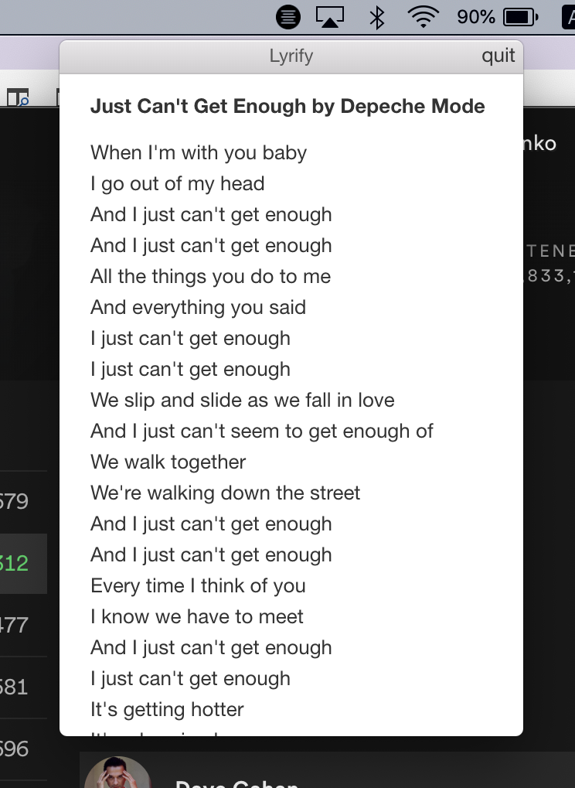

# Lyrify

> Mac tray app for spotify lyrics

Displays the lyrics to currently playing spotify song



## Dev

Don't forget to create your own `.env`

yarn or npm

```bash
    yarn install
    yarn dev
    # build release for mac
    yarn dist
```

Also check out web scraper for that client [here](https://github.com/kusturitza/scraperLyrify)


